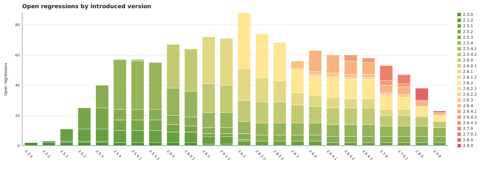

# regression-chart

`regression-chart` extracts regression information from the local `git-bug` bridge data in `.git/git-bug`, augments closed issues with their GitHub milestone, and writes machine-readable summaries plus human-readable reports.

The implementation is a standalone Python 3 script that uses only the standard library plus the external `git bug` and optional `gh` CLIs.

## How it works

1. It runs `git bug bug --format json` in the target repository and selects issues labeled `regression in VER`.
2. It reads the bridged GitHub issue URL for each selected issue and extracts the GitHub issue number.
3. For closed issues, it queries the GitHub GraphQL API for the closing milestone.
4. It computes:
   - regressions grouped by introduced version
   - how many regressions each milestone closes, grouped by introduced version
   - how many regressions are still open at each milestone, grouped by introduced version
5. It renders the aggregated data as JSON, a markdown table, and an SVG stacked bar chart.

## Example

Regressions for Agda 2.3.0 - 2.9.0.



## Running the tool

From the repository root:

```bash
cd src/release-tools/regression-chart
python3 main.py --repo-root /Users/abela/agda --out-dir /tmp/regression-chart
```

Or, when already in the repository root:

```bash
python3 ./src/release-tools/regression-chart/main.py --repo-root . --out-dir ./tmp/regression-chart
```

There is also a small wrapper script:

```bash
./src/release-tools/regression-chart/run.sh --repo-root . --out-dir ./tmp/regression-chart
```

To regenerate only the chart from previously computed JSON data:

```bash
python3 ./src/release-tools/regression-chart/main.py --out-dir ./tmp/regression-chart --chart-only
```

## Parameters

The tool accepts the following flags:

| Flag | Default | Description |
|---|---|---|
| `--repo-root` | `.` | Path to the Git repository root that contains `.git/git-bug`. The tool runs `git bug` there. This flag is ignored in `--chart-only` mode. |
| `--out-dir` | `.` | Directory in which generated files are written. The directory is created if needed. In `--chart-only` mode, this directory must already contain `regressions-open-by-milestone.json`. |
| `--owner` | `agda` | GitHub owner used for milestone lookups. This flag is only used in full generation mode. |
| `--repo` | `agda` | GitHub repository name used for milestone lookups. This flag is only used in full generation mode. |
| `--chart-only` | `false` | Regenerate `regressions-open-by-version.svg` from `regressions-open-by-milestone.json` without recomputing issue or milestone data. |

## Authentication

GitHub authentication is needed in full generation mode because closed issues are enriched with milestone data from the GitHub GraphQL API.

No GitHub authentication is needed in `--chart-only` mode.

The tool looks for authentication in this order:

1. `GITHUB_TOKEN`
2. `GH_TOKEN`
3. `gh auth token`

So either set a token environment variable or make sure `gh auth login` has already been run.

The local `git-bug` data itself does not need extra authentication, but the repository must have `git bug` installed and usable.

## Output

The tool writes five files into `--out-dir` in full generation mode:

| File | Description |
|---|---|
| `regressions-by-version.json` | For each introduced version, the list of regression issues. Closed issues include their closing milestone when it is a version milestone. If a closed issue has no usable version milestone, it is listed under `unclassified_closed_regressions`. |
| `regressions-closed-by-milestone.json` | For each milestone, a map from introduced version to the number of regressions closed in that milestone. |
| `regressions-open-by-milestone.json` | For each milestone, a map from introduced version to the number of regressions still open at that milestone. The milestone itself is included as the last possible introduced version in each row. |
| `regressions-open-by-version.md` | A markdown table of the open-regression matrix. |
| `regressions-open-by-version.svg` | A stacked bar chart of open regressions per milestone, colored by introduced version. |

In `--chart-only` mode, only `regressions-open-by-version.svg` is rewritten.

## Chart colors

The chart uses a palette generated by <https://gka.github.io/palettes/#/25|d|488f31,ffe692|ffe692,de425b|1|1>.

## Notes about the data

- Some issues in the bridged data currently carry more than one `regression in VER` label. The tool records all such labels in JSON and uses the earliest listed version as the introduced version for counting.
- Some closed issues may lack a usable version milestone on GitHub. Those issues are reported in `regressions-by-version.json` but excluded from milestone-based aggregates.
